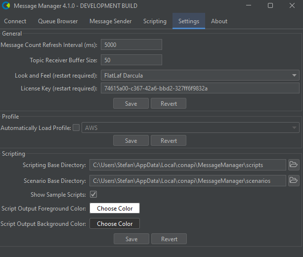

# Settings

You can configure generic settings for Message Manager in the settings tab. 

:::warning
Make sure you press the "Save" button to save your changes.
:::

## General

### Message count refresh interval
The interval in milliseconds to refresh the message count in the queue browser and topic subscriber.

### Topic receiver buffer size
Number of messages to buffer in the topic subscriber.

### Look and feel
Allows you to select the look and feel of the application. We recommend one of the FlatLaf themes.
In the screenshot above, we are using the FlatLaf Darcula (no this is not a typo) theme.
You have to restart Message Manager for the changes to take effect.

### License key
Shows the current license key. You can change the license key here as well.
You have to restart Message Manager for the changes to take effect.

## Profile

### Automatically load profile
Allows you to skip the profile selection step when starting Message Manager.
This is useful if you want to use the same profile for all your brokers.

## Scripting

### Scripting Base Directory
Allows you to specify the base directory for scripts.

### Scenario Base Directory
Allows you to specify the base directory for scenarios.

### Show Sample Scripts
If checked, shows sample scripts in the Scripts file tree.

### Script Output Foreground Color
Allows you to specify the foreground color for script output.

### Script Output Background Color
Allows you to specify the background color for script output.
