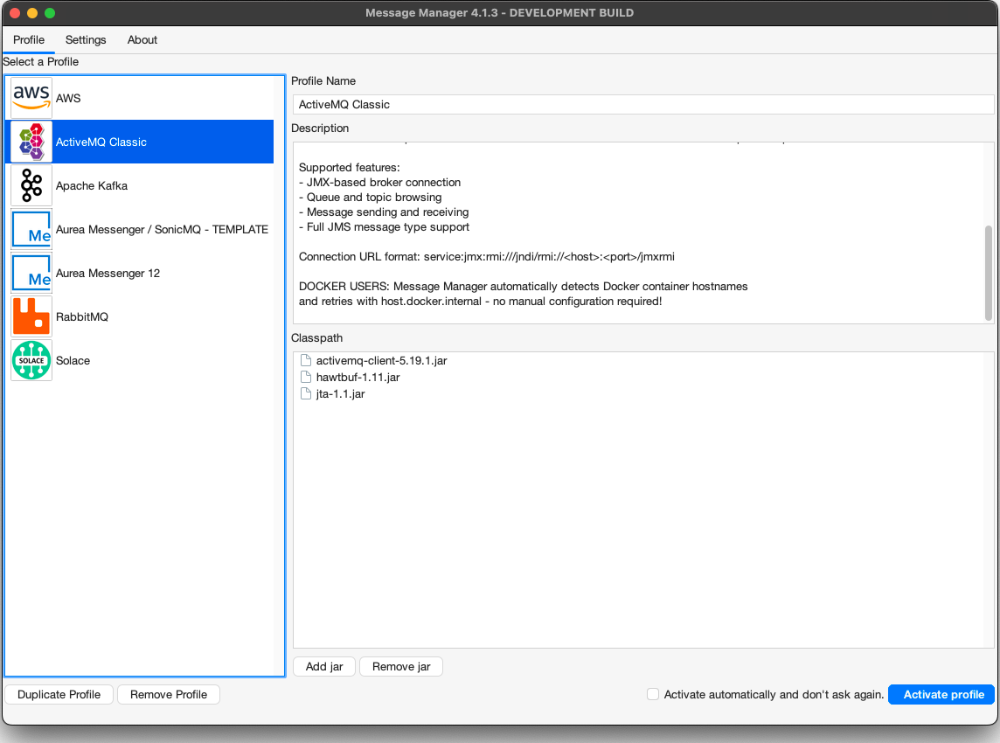
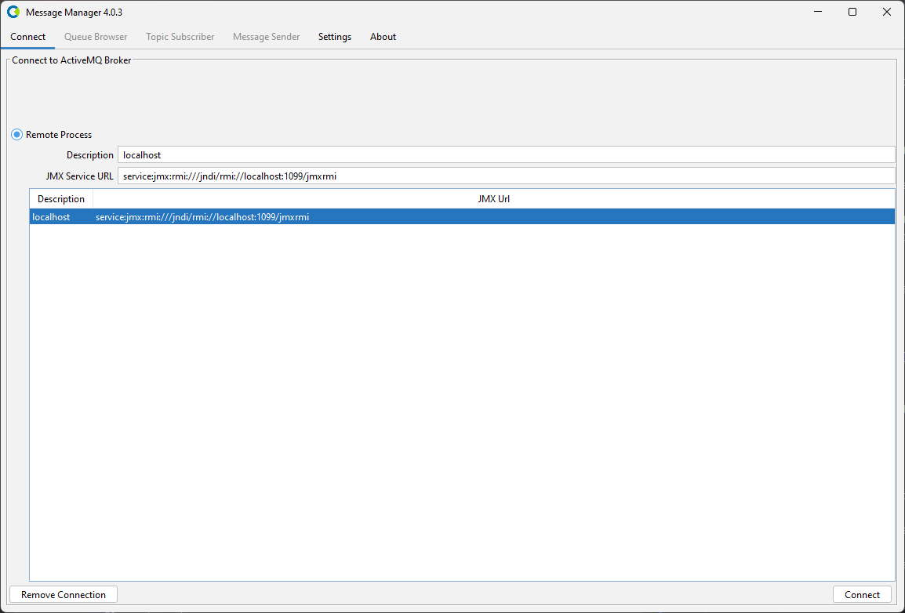

# ActiveMQ Classic

To work with Message Manager and Apache ActiveMQ Classic, a connection to an ActiveMQ installation using an ActiveMQ Profile is required.

## ActiveMQ Profile

The ActiveMQ Profile is available from the Profile List.

In order for the ActiveMQ Profile to be activated, the required ActiveMQ jars need to be added to the Message Manager classpath.
If the required ActiveMQ jars are not available in the classpath, they can be added using the 'Add JAR' button on the bottom middle of the window.
This will open a file selection dialog box where the proper ActiveMQ jar files can be added.

:::important
**ActiveMQ Classic 5.x Client Required**

This profile requires ActiveMQ Classic 5.x client libraries (javax.jms namespace).
The 5.x client is compatible with both ActiveMQ Classic 5.x and 6.x servers via the OpenWire protocol.
:::

The required ActiveMQ jars are (version 5.19.1):
- activemq-client-5.19.1.jar
- hawtbuf-1.11.jar
- jta-1.1.jar (required by ActiveMQ client)

Note: slf4j-api is not required as Message Manager already provides it.

:::note
The ActiveMQ Classic client jars can be found in the Message Manager Clients ActiveMQ directory or downloaded from Maven Central.
By default they are already added to the classpath.
:::

When the proper ActiveMQ Client jar is added (or when it is already available in the profile), the ActiveMQ Profile can be activated by selecting the "Activate Profile" button on the bottom right of the window.

:::tip
The option "Activate automatically and don't ask again" can be selected to activate the selected ActiveMQ Profile automatically when Message Manager starts.
:::

## ActiveMQ Connections

After the ActiveMQ Profile is activated, an ActiveMQ Connection can be created or an existing ActiveMQ Connection can be selected.

:::note
Message Manager uses JMX to connect to an ActiveMQ environment. It will then query the ActiveMQ environment for the available Brokers and Queues.
The ActiveMQ Connections require the JMX format: `service:jmx:rmi:///jndi/rmi://<host>:<port>/jmxrmi`
:::

Select the required Connection if it is available and press "Connect" to make the ActiveMQ Connection active.
If the required ActiveMQ Connection is not available, a new ActiveMQ Connection can be created.

## Create ActiveMQ Connection

To create a new ActiveMQ Connection, select the "Remote Process" Radio Button and fill out the new ActiveMQ Connection Information. 
- Description
    - A descriptive name for this Connection.
- JMX Service URL
    - The JMX Service URL of the ActiveMQ Installation to connect to.
    - The JMX Service URL format: `service:jmx:rmi:///jndi/rmi://<host>:<port>/jmxrmi`

When all the required information is entered, press the "Connect" button to activate the ActiveMQ Connection and switch to the Queue Browser tab of Message Manager.

Select the Queue you wish to browse and the message in the Queue (if any) to show the Message Details.
