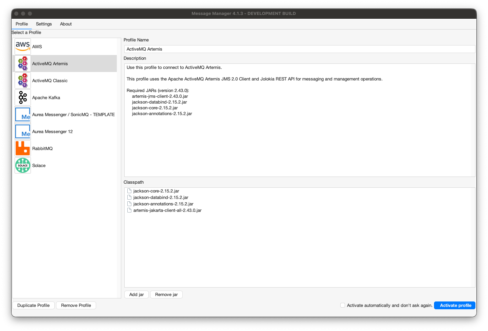
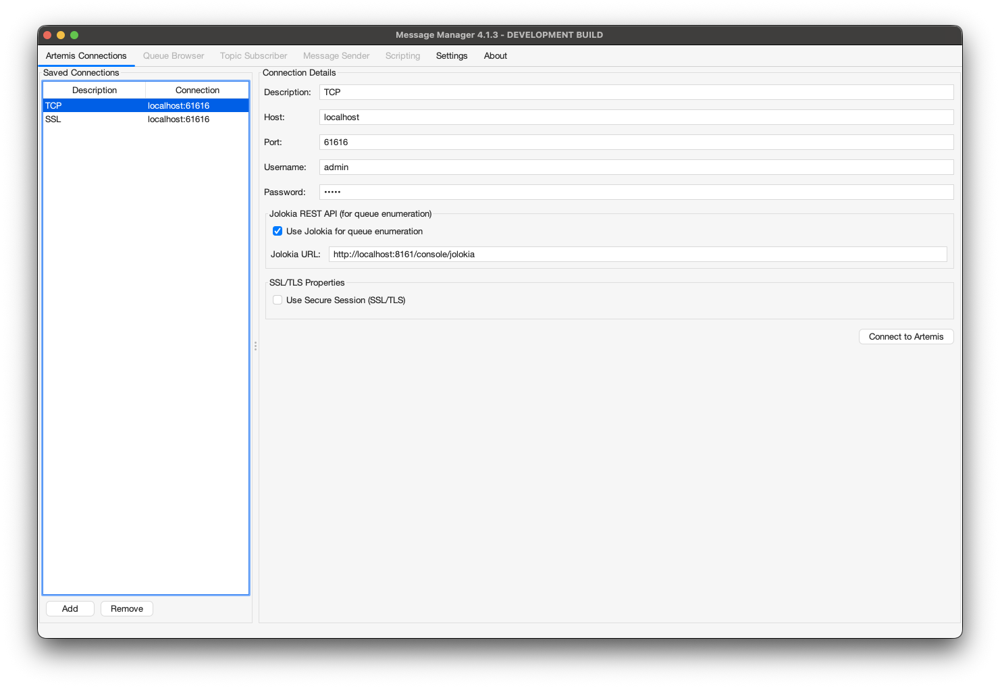
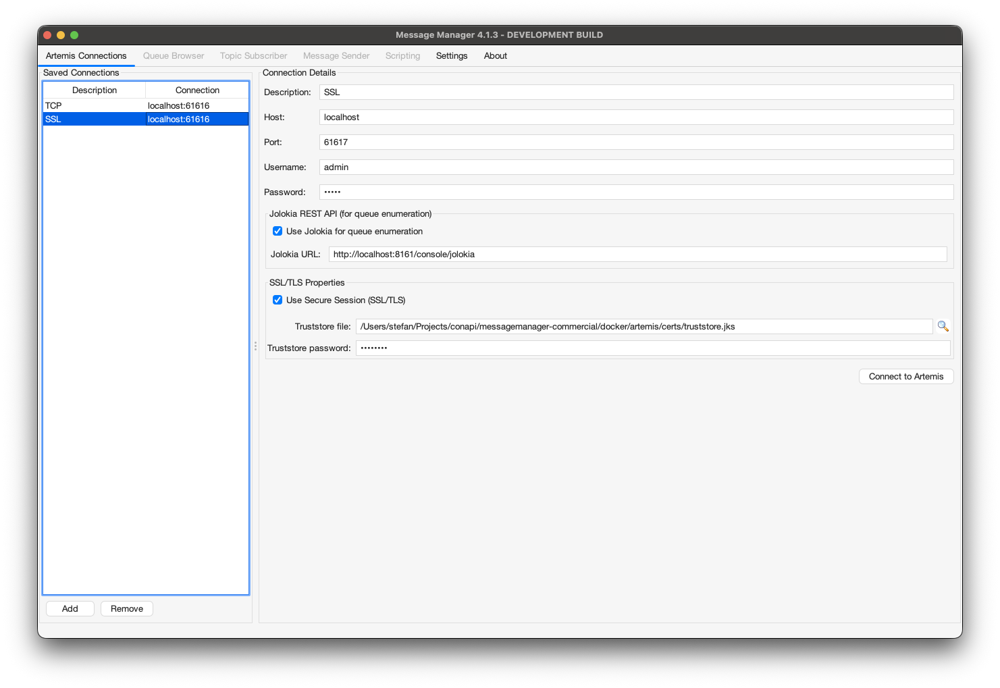

# ActiveMQ Artemis

To work with Message Manager and Apache ActiveMQ Artemis, a connection to an Artemis installation using an ActiveMQ Artemis Profile is required.

## ActiveMQ Artemis Profile

The ActiveMQ Artemis Profile is available from the Profile List.



In order for the ActiveMQ Artemis Profile to be activated, the required Artemis client jars need to be added to the Message Manager classpath.
If the required Artemis jars are not available in the classpath, they can be added using the 'Add JAR' button on the bottom middle of the window.
This will open a file selection dialog box where the proper Artemis jar files can be added.

:::important
**ActiveMQ Artemis vs Classic**

ActiveMQ Artemis is the next-generation message broker from Apache ActiveMQ.
It is a complete rewrite with different client libraries, protocols, and management APIs.
This is a separate profile from the ActiveMQ Classic profile.
:::

The required Artemis jars are (version 2.43.0):
- artemis-jakarta-client-all-2.43.0.jar
- jackson-core-2.15.2.jar
- jackson-databind-2.15.2.jar
- jackson-annotations-2.15.2.jar

:::note
The ActiveMQ Artemis client jars can be found in the Message Manager Clients Artemis directory or downloaded from Maven Central.
By default they are already added to the classpath.
:::

When the proper Artemis Client jars are added (or when they are already available in the profile), the ActiveMQ Artemis Profile can be activated by selecting the "Activate Profile" button on the bottom right of the window.

:::tip
The option "Activate automatically and don't ask again" can be selected to activate the selected ActiveMQ Artemis Profile automatically when Message Manager starts.
:::

## ActiveMQ Artemis Connections

After the ActiveMQ Artemis Profile is activated, an Artemis Connection can be created or an existing Artemis Connection can be selected.

Select the required Connection if it is available and press "Connect" to make the Artemis Connection active.
If the required Artemis Connection is not available, a new Artemis Connection can be created.

## Create ActiveMQ Artemis Connection

To create a new Artemis Connection, select the "New" button on the bottom (the green + button) and enter the new Artemis Connection Information.

### Basic Connection (Username/Password)

For a standard connection to ActiveMQ Artemis using username and password authentication:



- **Description**
    - A descriptive name for this Connection
- **Connection Details**
    - Host - The hostname or IP address of the Artemis server
    - Port - The Artemis port for client connections
    - Username - The Artemis username for authentication
    - Password - The Artemis password for authentication
- **Jolokia Management API**
    - Jolokia URL - URL for Jolokia REST API (auto-constructed from host if not specified)
    - Example: `http://localhost:8161/console/jolokia`

:::note
**Jolokia REST API**

Message Manager uses the Jolokia REST API to connect to Artemis for queue enumeration and management operations.
The Jolokia URL is automatically constructed based on the host you provide.
If your Artemis installation uses a different Jolokia endpoint, you can override the URL manually.
:::

### SSL/TLS Connection

For a secure SSL/TLS connection to ActiveMQ Artemis:



- **Description**
    - A descriptive name for this Connection
- **Connection Details**
    - Host - The hostname or IP address of the Artemis server
    - Port - The Artemis SSL/TLS port for client connections
    - Username - The Artemis username for authentication
    - Password - The Artemis password for authentication
- **SSL/TLS**
    - Use SSL/TLS - Check this box to enable encrypted connections
    - Trust Store - Path to the Java truststore containing the Artemis server's CA certificate
    - Trust Store Password - Password for the truststore file
    - Enabled Protocols - TLS protocol versions (default: TLSv1.2,TLSv1.3)
- **Jolokia Management API**
    - Jolokia URL - URL for Jolokia REST API (auto-constructed as HTTPS when SSL enabled)
    - Example: `https://localhost:8161/console/jolokia`

:::important
**SSL/TLS Truststore Configuration**

When connecting via SSL/TLS, you must configure a truststore containing the Certificate Authority (CA) certificate that signed your Artemis server's certificate:

1. Obtain the CA certificate from your Artemis server administrator
2. Import the CA certificate into a Java truststore using `keytool`:
   ```bash
   keytool -import -alias artemis-ca -file ca-cert.pem -keystore truststore.jks -storepass changeit
   ```
3. Specify the truststore path and password in the SSL/TLS section

If you're using self-signed certificates, import the self-signed certificate itself into the truststore.
:::

### Client Certificate Connection (Mutual TLS)

For client certificate authentication with mutual TLS:

- **Description**
    - A descriptive name for this Connection
- **Connection Details**
    - Host - The hostname or IP address of the Artemis server
    - Port - The Artemis mutual TLS port for client connections
    - Username - The Artemis username (may be derived from certificate)
    - Password - The Artemis password (may be derived from certificate)
- **SSL/TLS**
    - Use SSL/TLS - Must be enabled for client certificate authentication
    - Trust Store - Path to the Java truststore containing the Artemis server's CA certificate
    - Trust Store Password - Password for the truststore file
    - Key Store - Path to the Java keystore containing your client certificate
    - Key Store Password - Password for the keystore file
    - Enabled Protocols - TLS protocol versions (default: TLSv1.2,TLSv1.3)
- **Jolokia Management API**
    - Jolokia URL - URL for Jolokia REST API (auto-constructed as HTTPS)
    - Example: `https://localhost:8161/console/jolokia`

:::important
**Client Certificate Setup**

For client certificate authentication, you need both a truststore (server's CA) and a keystore (your client certificate):

1. **Truststore** - Contains the server's CA certificate (same as SSL/TLS)
2. **Keystore** - Contains your client certificate and private key:
   ```bash
   keytool -genkeypair -alias client -keyalg RSA -keystore keystore.jks -storepass changeit
   ```

Your Artemis server must be configured to accept client certificates and map certificate DNs to users.
:::

### Connecting

When all the required information is entered, press the "Connect" button to activate the Artemis Connection and switch to the Queue Browser tab of Message Manager.

Select the Queue you wish to browse and the message in the Queue (if any) to show the Message Details.

## Supported Features

The ActiveMQ Artemis profile supports:

- **Queue Operations**
  - Browse queue contents
  - Send messages to queues
  - View message counts
  - Queue enumeration via Jolokia
- **Message Operations**
  - **Forward messages** (drag-and-drop between queues)
  - **Delete specific messages**
  - **Purge entire queue** (bulk clear)
  - Set message priority
- **Topic Subscriber**
  - Subscribe to topics
  - Receive messages from topic subscriptions
  - Multiple subscribers receive message copies (pub/sub semantics)
  - Publish messages to topics
- **Security**
  - Basic username/password authentication
  - SSL/TLS encrypted connections
  - Client certificate authentication (mutual TLS)
  - Configurable TLS protocol versions

## Requirements

:::important
**Jolokia REST API Required**

ActiveMQ Artemis queue operations require the Jolokia REST API to be enabled on your Artemis server.
Jolokia is enabled by default in standard Artemis installations.

If Jolokia is not available, basic JMS operations (send/receive) will still work, but queue enumeration and management operations will be unavailable.
:::

## Troubleshooting

### Cannot connect to Artemis

- Verify the host and port are correct
- Check that Artemis is running and accepting connections
- Verify username and password credentials
- For SSL connections, ensure the truststore contains the correct CA certificate

### Jolokia connection fails

- Verify Jolokia is enabled on your Artemis server
- Check the Jolokia URL is correct (default: `http://host:8161/console/jolokia`)
- Ensure the same credentials work for both JMS and Jolokia
- For SSL, use `https://` in the Jolokia URL

### SSL connection fails

- Verify the truststore path is correct
- Check the truststore password
- Ensure the server's CA certificate is in the truststore
- Review enabled protocols match your server configuration

### Client certificate authentication fails

- Verify both truststore and keystore paths are correct
- Check both passwords
- Ensure your client certificate is trusted by the Artemis server
- Verify the certificate DN is mapped to a user on the server
