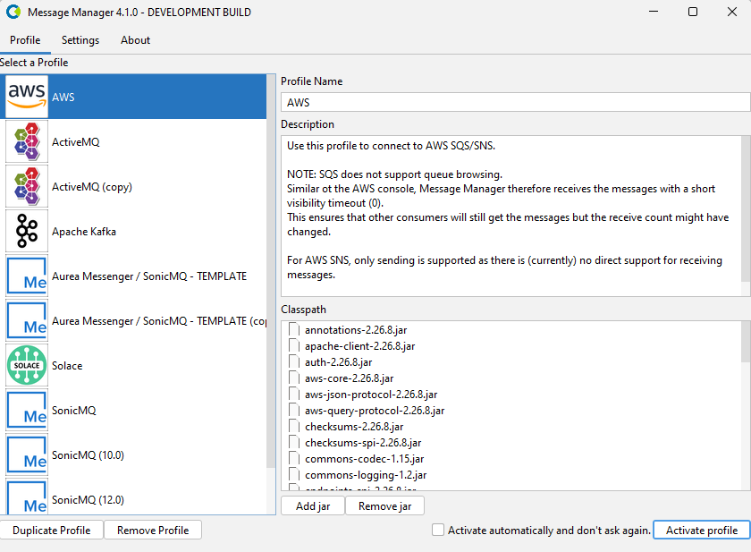
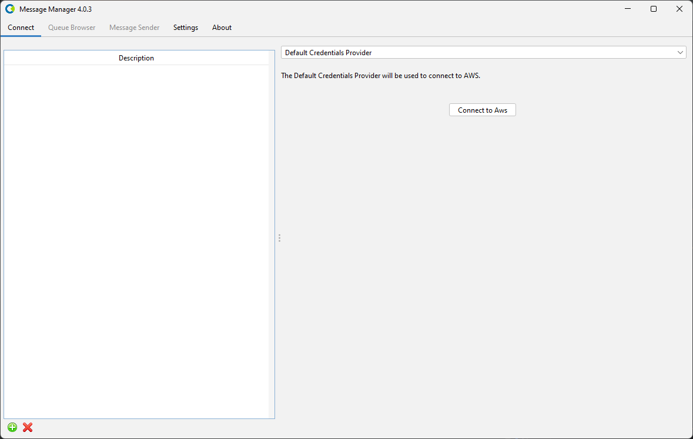
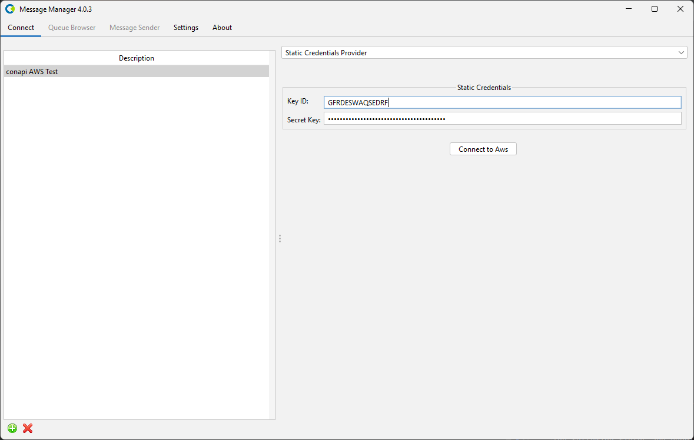
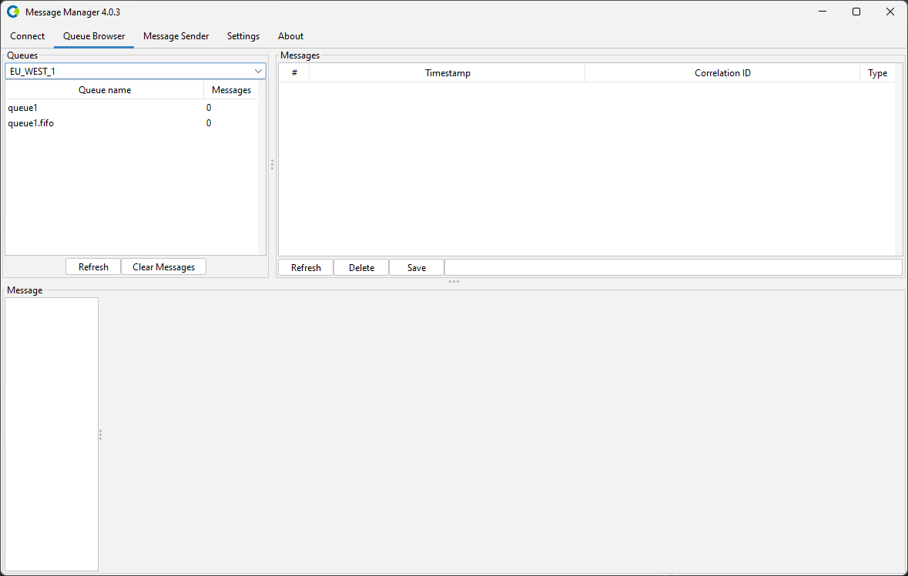
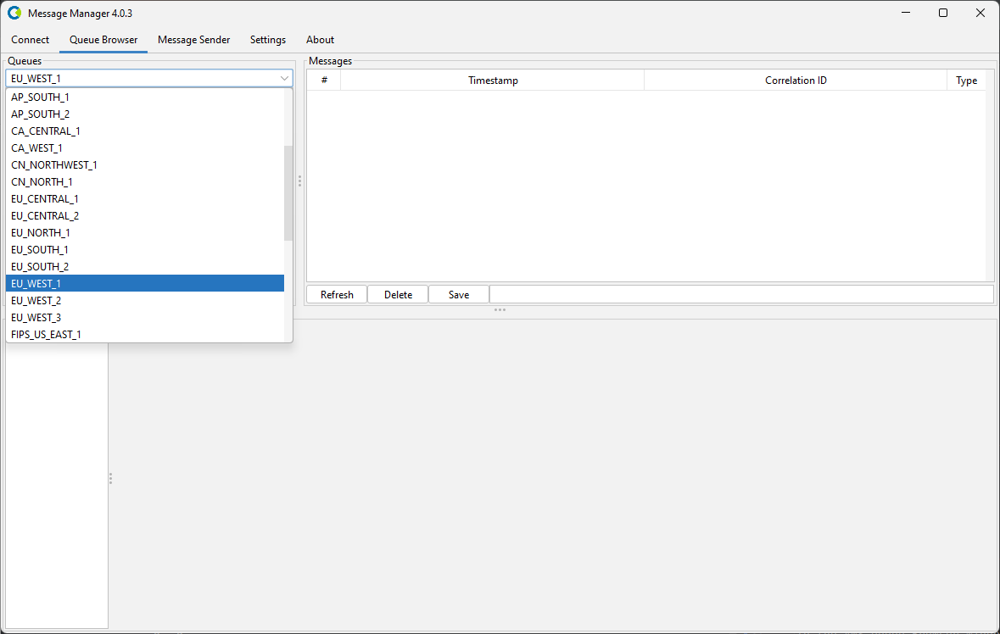
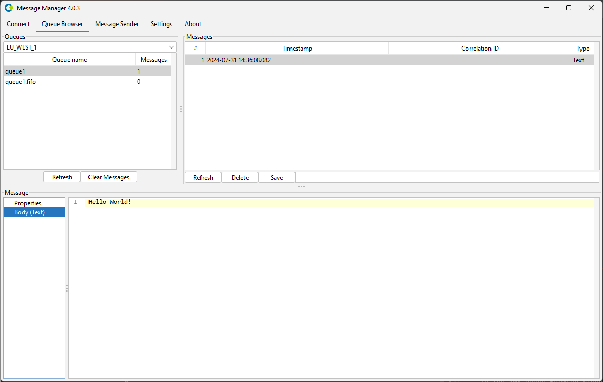

# AWS SQS/SNS

To work with Message Manager and AWS Simple Queue Services or Simple Notification Services, you first
need to create a connection to AWS SQS/SNS using an AWS Profile.

Select the AWS Profile and press the "Activate Profile" button on the bottom right of the window.
You can select the 'Active automatically and dont ask again' option to activate the AWS Profile automatically
when Message Manager starts.

:::note
AWS SQS does not support queue browsing. Similar ot the AWS console, Message Manager therefore receives the messages with a short visibility timeout (0).
This ensures that other consumers will still get the messages but the receive-count might have changed.

For AWS SNS, only sending is supported as there is (currently) no direct support for receiving messages.
:::

After you have activated the AWS Profile, you get an overview of existing AWS Connections.

Select the AWS Connection you want to use or, when the Connections List is empty, create a new AWS Connection.

## Create Connection

To create a new AWS Connection, select the "New" button on the bottom (the green + button).
Name the new AWS Connection by double-clicking the 'New Connection' list entry and entering a name. 
For the new AWS Connection, select the Credential Provider you wish to use and enter the proper Credential Information.

When all the information is entered, press the 'Connect to AWS' button to activate the connection and switch to the Queue
Browser tab of Message Manager.

In the AWS Queue Browser window you can select the AWS Region to want to work in.

After you have selected the AWS Region, you can select the Queues you want to work with. 
Select the Queue you wish to browse and the message in the Queue (if any) to show the Message Details.

