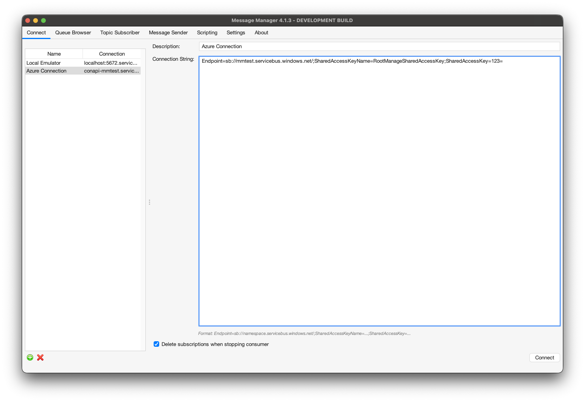

# Azure Service Bus

To work with Message Manager and Azure Service Bus, a connection to an Azure Service Bus namespace using an Azure Service Bus Profile is required.

## Azure Service Bus Profile

The Azure Service Bus Profile is available from the Profile List.

:::important
**Azure Service Bus Requirements**

Azure Service Bus is Microsoft's enterprise message broker service running in the Azure cloud.
It requires the Azure Service Bus client libraries which are automatically included with Message Manager.
:::

Select the Azure Service Bus Profile and press the "Activate Profile" button on the bottom right of the window.

:::tip
The option "Activate automatically and don't ask again" can be selected to activate the Azure Service Bus Profile automatically when Message Manager starts.
:::

## Azure Service Bus Connections

After the Azure Service Bus Profile is activated, an Azure Connection can be created or an existing Azure Connection can be selected.



Select the required Connection if it is available and press "Connect" to make the Azure Service Bus Connection active.
If the required Azure Connection is not available, a new Azure Connection can be created.

## Create Azure Service Bus Connection

To create a new Azure Service Bus Connection, select the "New" button on the bottom (the green + button) and enter the new Azure Connection Information.


- **Description**
    - A descriptive name for this Connection
- **Connection String**
    - The complete connection string from Azure portal (includes Shared Access Signature credentials)
- **Delete subscriptions when stopping consumer** (checkbox)
    - If unchecked (recommended), subscriptions are kept for faster toggle performance
    - Note: Azure subscriptions do not auto-expire - cleanup manually if needed

:::note
**Getting Your Connection String**

To get your Azure Service Bus connection string:
1. Open the Azure portal
2. Navigate to your Service Bus namespace
3. Under "Settings", select "Shared access policies"
4. Select an access policy (e.g., RootManageSharedAccessKey for full access)
5. Copy the "Primary Connection String" value

The connection string format includes the Shared Access Signature:
```
Endpoint=sb://namespace.servicebus.windows.net/;SharedAccessKeyName=RootManageSharedAccessKey;SharedAccessKey=xxxxx
```

**Permissions:** Different access policies provide different permissions:
- **RootManageSharedAccessKey**: Full access (send, listen, manage)
- **Send**: Can only send messages
- **Listen**: Can only receive messages
- **Manage**: Can create/delete queues and topics

Choose the appropriate policy based on your needs.
:::

### Connecting

When all the required information is entered, press the "Connect" button to activate the Azure Service Bus Connection and switch to the Queue Browser tab of Message Manager.

Select the Queue you wish to browse and the message in the Queue (if any) to show the Message Details.

## Supported Features

The Azure Service Bus profile supports:

- **Queue Operations**
  - Browse queue contents (max 500 messages per browse)
  - Send messages to queues
  - View message counts
  - Queue enumeration via Azure Management API
- **Message Operations**
  - **Delete specific messages** (searches first 200 messages)
  - Set time-to-live (TTL)
  - Set correlation ID for request/reply patterns
- **Topic/Subscription Operations**
  - Publish messages to topics
  - Subscribe to topics (auto-managed subscriptions)
  - Receive messages from topic subscriptions
  - Multiple subscribers receive message copies (pub/sub semantics)
  - Topic and subscription enumeration
  - Auto-create subscriptions with stable naming
  - Reuse subscriptions across application restarts
  - Configurable subscription cleanup on consumer stop
- **Message Properties**
  - System properties (MessageId, ContentType, etc.)
  - Custom application properties
  - Correlation ID for request/reply patterns
- **Security**
  - Connection string authentication with Shared Access Signature
  - Always uses SSL/TLS encryption (required by Azure)

## Topic Subscription Management

Azure Service Bus topics use server-side subscriptions (similar to durable subscribers in JMS). Message Manager automatically manages these subscriptions for you:

### Auto-Managed Subscriptions

When you start consuming messages from a topic (by toggling it on in the Topic Subscriber tab):
1. Message Manager automatically creates a subscription with a stable name: `messagemanager-{topic}-{id}`
2. The same subscription is reused if you stop and restart the consumer
3. This provides fast toggle performance and preserves message ordering

### Subscription Cleanup

You can control whether subscriptions are deleted when you stop consuming:
- **Delete subscriptions when stopping consumer = unchecked (recommended)**
  - Subscriptions remain on the server for fast restart
  - Messages continue to accumulate while consumer is stopped
  - Better for development and frequent toggling

- **Delete subscriptions when stopping consumer = checked**
  - Subscriptions are deleted when you stop the consumer
  - No messages accumulate while consumer is stopped
  - Cleaner but slower toggle performance

:::important
**Manual Cleanup**

Azure Service Bus subscriptions do not auto-expire. If you create many test subscriptions, you may need to clean them up manually using:
- Azure Portal (Service Bus Explorer)
- Azure CLI: `az servicebus topic subscription delete`
- The subscription naming pattern makes Message Manager subscriptions easy to identify
:::

## Limitations

The Azure Service Bus plugin has the following limitations:

- **Browse Limit**: Queue browsing is limited to 500 messages per browse operation
- **Search Limit**: Message delete operations search only the first 200 messages in a queue
  - This is optimized for DevOps use cases where problem messages are typically at the front
- **No Message Forwarding**: Message forwarding (drag-and-drop between queues/topics) is not currently supported
  - The Azure SDK requires a search-based approach that locks messages in batches
  - Concurrent browse operations can interfere with the search, causing messages to be missed or lost
  - Messages locked during search can become invisible to other operations
  - Future implementation will use Azure transactions for atomic send+complete operations
- **No Bulk Purge**: Azure Service Bus has no bulk "clear all messages" API
  - Deleting all messages requires iterating through each message individually
- **Message Priority**: Azure Service Bus does not support message priority
- **Message Selectors**: Not supported in this version

## Requirements

:::important
**Azure Subscription Required**

To use Azure Service Bus with Message Manager, you need:
- An active Azure subscription
- A Service Bus namespace created in Azure portal
- At least one queue or topic created
- Appropriate access policy with send/listen/manage permissions
:::

## Troubleshooting

### Cannot connect to Azure Service Bus

- Verify the connection string is complete and correct
- Check that the namespace URL in the connection string is correct (format: `namespace.servicebus.windows.net`)
- Ensure the access policy has the required permissions (at minimum: Listen, Send)
- Verify your Azure subscription is active and the namespace is running
- Check for firewall rules blocking access to Azure Service Bus

### Connection string format error

- Ensure you copied the complete connection string from Azure portal
- Connection string must include `Endpoint=`, `SharedAccessKeyName=`, and `SharedAccessKey=`
- Check for any extra spaces or line breaks in the connection string

### Cannot see queues or topics

- Verify the access policy has "Manage" or at least "Listen" permissions
- Check that queues/topics exist in the Azure portal
- Ensure the namespace is in the correct Azure region
- Verify you're using the correct namespace

### Messages not appearing in queue

- Check if messages are being sent to a topic instead of a queue
- Verify the queue name is correct (Azure is case-sensitive)
- Check if messages expired (default TTL is 14 days)
- Verify the access policy has the required permissions to receive messages

### Topic subscription issues

- Verify the topic exists in Azure portal
- Check that the connection has "Manage" or "Listen" permissions for subscription creation
- If delete-on-close is enabled, subscriptions are removed when you stop the consumer
- Look for subscriptions with pattern `messagemanager-{topic}-*` in Azure portal

## Best Practices

### Security

- Create separate access policies for different use cases (send-only, listen-only, manage)
- Use policies with minimal required permissions instead of RootManageSharedAccessKey
- Rotate Shared Access Keys regularly using Azure portal
- Never commit connection strings to source control
- Store connection strings in environment variables or secure configuration

### Performance

- Keep "Delete subscriptions when stopping consumer" unchecked for faster toggle performance
- Use topic subscriptions for pub/sub scenarios where multiple consumers need the same messages
- Set appropriate TTL values to prevent message buildup
- Consider using correlation IDs for request/reply patterns

### Subscription Management

- Use descriptive connection descriptions to identify subscriptions in Azure portal
- Monitor subscription message counts in Azure portal
- Clean up unused subscriptions periodically (look for `messagemanager-*` pattern)
- Use delete-on-close option for temporary test scenarios only

### Development Workflow

- Use separate Azure namespaces for dev/test/prod environments
- Create dedicated access policies for Message Manager with Listen+Send permissions
- Test with small message volumes first to verify configuration
- Monitor Azure Service Bus metrics for errors and throttling

## Additional Resources

- [Azure Service Bus Documentation](https://docs.microsoft.com/en-us/azure/service-bus-messaging/)
- [Azure Service Bus Pricing](https://azure.microsoft.com/en-us/pricing/details/service-bus/)
- [Best Practices for Azure Service Bus](https://docs.microsoft.com/en-us/azure/service-bus-messaging/service-bus-performance-improvements)
