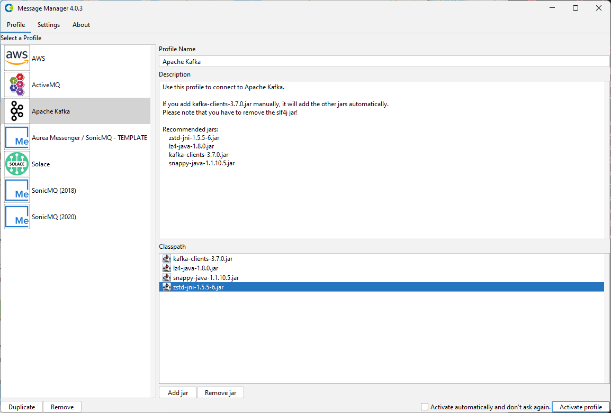
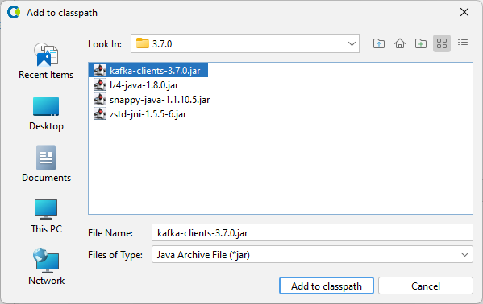
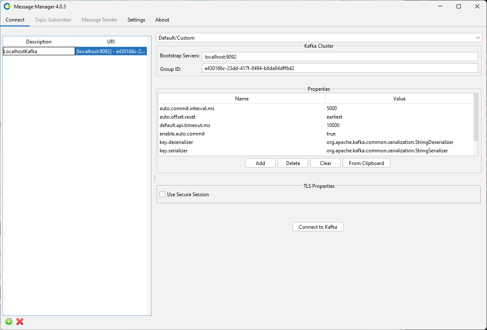
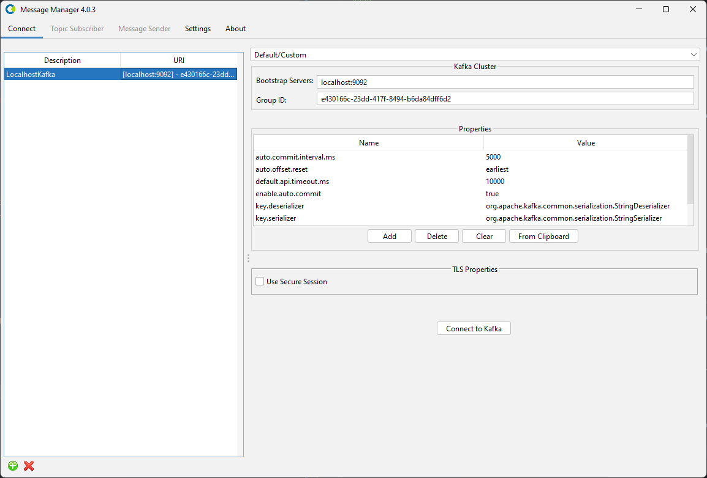
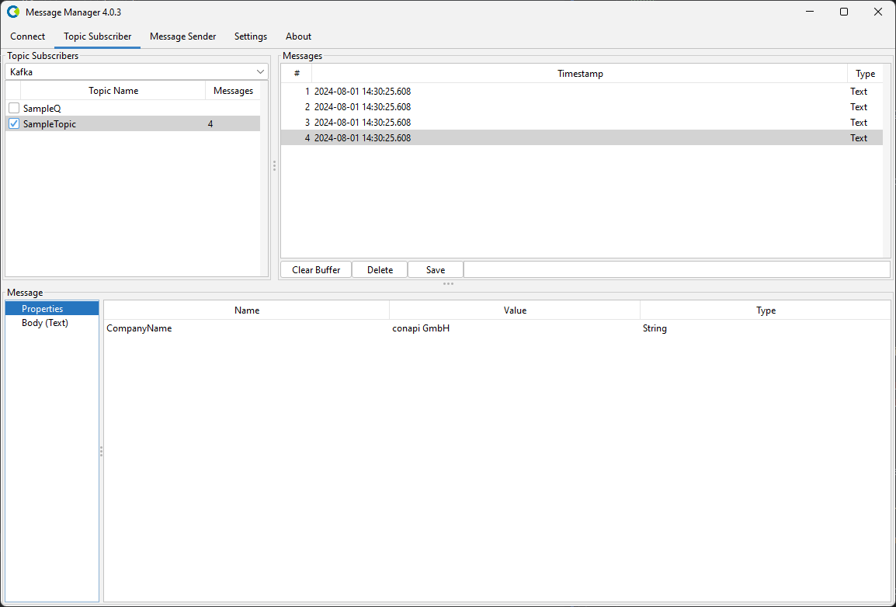

# Apache Kafka

To work with Message Manager and Apache Kafka, a connection to a Kafka installation using a Kafka Profile is required.

## Apache Kafka Profile

The Apache Kafka Profile is available from the Profile List.

In order for the Apache Kafka Profile to be activated, the Kafka Client jars need to be added to the Message Manager classpath.
If the Apache Kafka Client jars are not available in the classpath, they can be added using the 'Add JAR' button on the bottom middle of the window.
This will open a file selection dialog box where the proper Apache Kafka Client jar files can be added to the classpath.
For Apache Kafka 2.x, the following jars need to be added and should already been added to the classpath:
- kafka-clients-3.7.0.jar
- lz4-java-1.8.0.jar
- zstd-jni-1.5.5-6.jar
- snappy-java-1.1.10.5.jar

:::note
Message Manager Apache Kafka Client jars can be found in the Message Manager Clients Kafka directory.
By default they are already added to the classpath. 
:::

When the proper Apache Kafka Client jars are added (or when they are already available in the profile), the Apache Kafka Profile can be activated by selecting the "Activate Profile" button on the bottom right of the window.

:::tip
The option "Activate automatically and don't ask again" can be selected to activate the selected Kafka Profile automatically when Message Manager starts.
:::

## Apache Kafka Connections

After the Apache Kafka Profile is activated, an Apache Kafka Connection can be created or an existing Apache Kafka Connection can be selected.

Select the required Connection if it is available and press "Connect to Kafka" to make the Kafka Connection active.
If the required Kafka Connection is not available, a new Kafka Connection can be created.

## Create Apache Kafka Connection

To create a new Apache Kafka Connection, select the "New" button on the bottom (the green + button) and enter the new Apache Kafka Connection Information. 
- Description
    - A descriptive name for this Connection.
- URI
    - This string is created using the information entered in the connection details screen.

When all the required information is entered, press the "Connect to Kafka" button to activate the Apache Kafka Connection and switch to the Topic Subscriber tab of Message Manager.

Select the Topic you wish to browse and the message in the Topic (if any) to show the Message Details.
