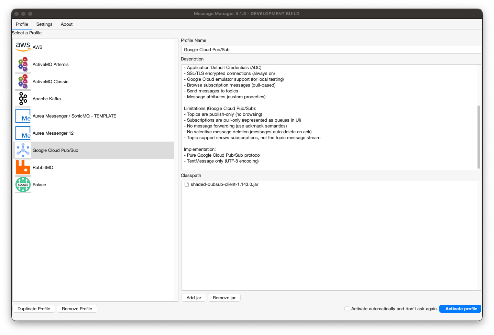
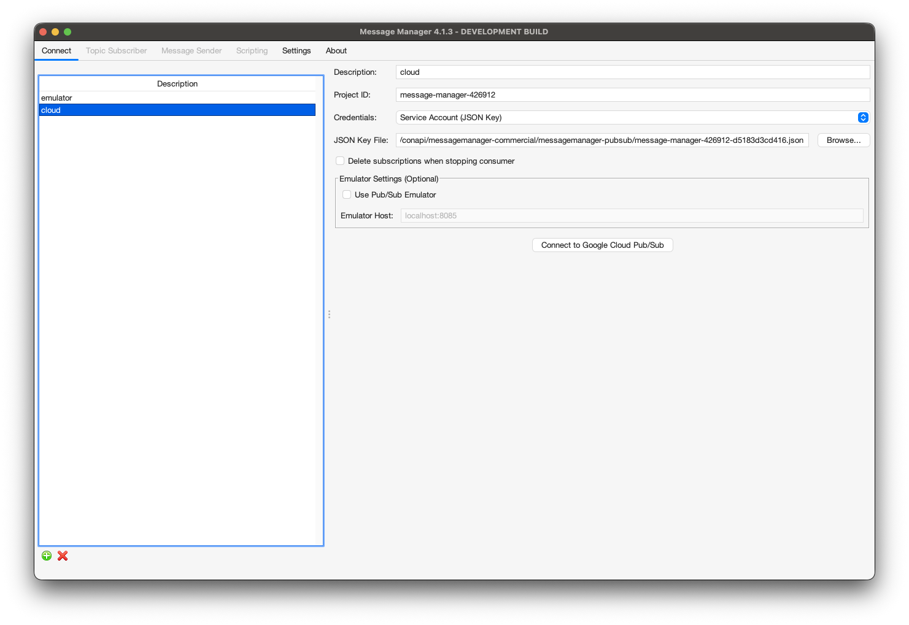
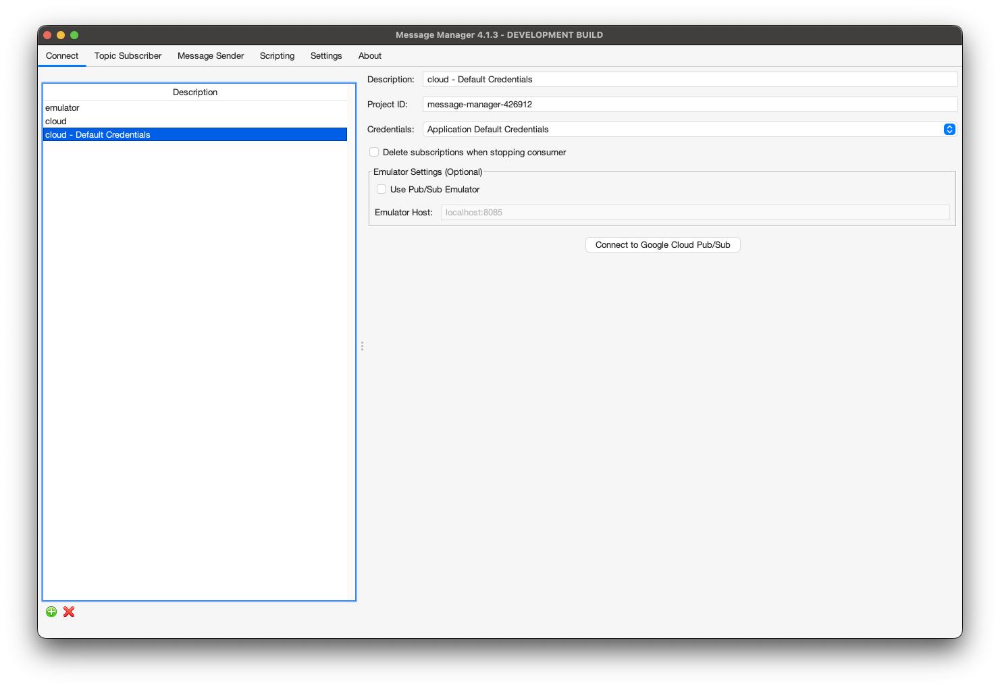
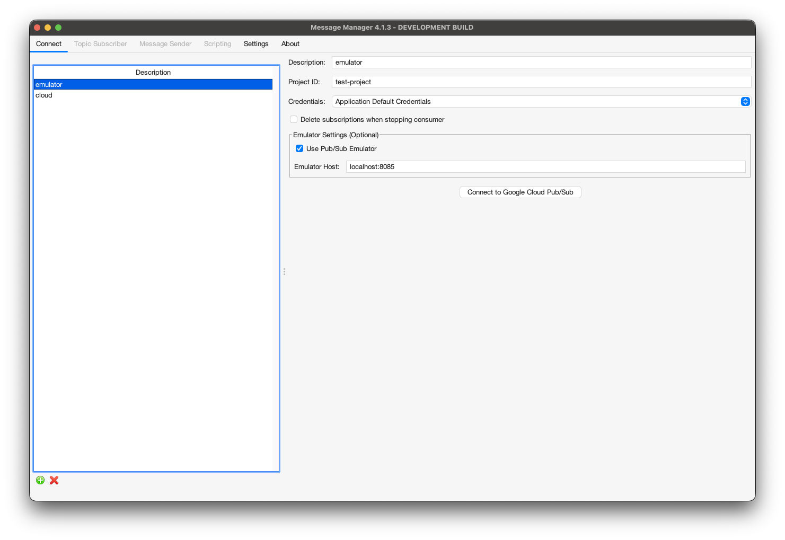

# Google Cloud Pub/Sub

To work with Message Manager and Google Cloud Pub/Sub, a connection to a Google Cloud project using the Google Cloud Pub/Sub Profile is required.

## Google Cloud Pub/Sub Profile

The Google Cloud Pub/Sub Profile is available from the Profile List.



In order for the Google Cloud Pub/Sub Profile to be activated, the required Google Cloud client jar needs to be added to the Message Manager classpath.
If the required jar is not available in the classpath, it can be added using the 'Add JAR' button on the bottom middle of the window.
This will open a file selection dialog box where the proper Google Cloud Pub/Sub jar file can be added.

The required Google Cloud Pub/Sub jar is (version 1.143.0):
- shaded-pubsub-client-1.143.0.jar (34MB)

:::note
The Google Cloud Pub/Sub client jar can be found in the Message Manager Clients pubsub directory or downloaded from the Message Manager distribution.
By default it is already added to the classpath.

The jar is shaded with all Google Cloud SDK packages relocated to `at.conapi.pubsub.shaded.*` to avoid conflicts with other Message Manager components.
:::

When the proper Google Cloud Pub/Sub Client jar is added (or when it is already available in the profile), the Google Cloud Pub/Sub Profile can be activated by selecting the "Activate Profile" button on the bottom right of the window.

:::tip
The option "Activate automatically and don't ask again" can be selected to activate the selected Google Cloud Pub/Sub Profile automatically when Message Manager starts.
:::

## Google Cloud Pub/Sub Connections

After the Google Cloud Pub/Sub Profile is activated, a Pub/Sub Connection can be created or an existing connection can be selected.

Select the required Connection if it is available and press "Connect" to make the Pub/Sub Connection active.
If the required Pub/Sub Connection is not available, a new connection can be created.

## Create Google Cloud Pub/Sub Connection

To create a new Pub/Sub Connection, select the "New" button on the bottom (the green + button) and enter the new connection information.

### Service Account (JSON Key) Connection

For production deployments using a service account JSON key file:



- **Description**
    - A descriptive name for this Connection
- **Project ID** (required)
    - Your Google Cloud Project ID
    - Can be found in the GCP Console
- **Credentials**
    - Select "Service Account (JSON Key)"
- **JSON Key File**
    - Path to the service account JSON key file downloaded from GCP Console
    - Click "Browse..." to select the file
- **Delete subscriptions when stopping consumer**
    - If unchecked (recommended): Subscriptions are kept for faster toggle performance and reused on restart
    - If checked: Subscriptions are deleted when stopping the consumer
    - Subscriptions auto-expire after 31 days of inactivity regardless of this setting

:::important
**Service Account Setup**

To create a service account and download the JSON key file:

1. Go to the [GCP Console IAM & Admin → Service Accounts](https://console.cloud.google.com/iam-admin/serviceaccounts)
2. Click "Create Service Account"
3. Grant the service account the "Pub/Sub Editor" role
4. Create a JSON key and download it to your local machine
5. Specify the path to the downloaded JSON file in the connection settings

**Required Permissions:**
- `pubsub.subscriptions.create`
- `pubsub.subscriptions.delete`
- `pubsub.subscriptions.get`
- `pubsub.subscriptions.consume`
- `pubsub.topics.publish`
- `pubsub.topics.list`
:::

### Application Default Credentials (ADC) Connection

For local development or deployments on GCE/GKE using Application Default Credentials:



- **Description**
    - A descriptive name for this Connection
- **Project ID** (required)
    - Your Google Cloud Project ID
- **Credentials**
    - Select "Application Default Credentials"
- **Delete subscriptions when stopping consumer**
    - Same behavior as Service Account configuration

:::tip
**Application Default Credentials (ADC) Discovery**

ADC automatically discovers credentials from your environment in this order:

1. **GOOGLE_APPLICATION_CREDENTIALS** environment variable pointing to a JSON key file
2. **gcloud CLI** credentials (`gcloud auth application-default login`)
3. **Compute Engine/GKE metadata server** (when running on GCP)

This is the recommended authentication method for:
- Local development (using gcloud CLI)
- Applications running on Google Compute Engine
- Applications running on Google Kubernetes Engine (GKE)

Setup for local development:
```bash
gcloud auth application-default login
```
:::

### Emulator Connection

For local testing without a Google Cloud account:



- **Description**
    - A descriptive name for this Connection
- **Project ID** (required)
    - Any project ID (doesn't need to exist in GCP)
- **Credentials**
    - Any authentication method (ignored by emulator)
- **Use Pub/Sub Emulator**
    - Check this box to connect to the local emulator
- **Emulator Host**
    - Host and port of the emulator (default: localhost:8085)
- **Delete subscriptions when stopping consumer**
    - Same behavior as cloud connections

:::note
**Google Cloud Pub/Sub Emulator Setup**

The emulator allows local development and testing without a Google Cloud account:

1. Install the emulator using gcloud:
   ```bash
   gcloud components install pubsub-emulator
   ```

2. Start the emulator:
   ```bash
   gcloud beta emulators pubsub start --host-port=localhost:8085
   ```

3. The emulator runs on `localhost:8085` by default
4. No authentication is required when using the emulator
5. All data is stored in memory and lost when the emulator stops

**Docker Alternative:**
```bash
docker run -p 8085:8085 google/cloud-sdk:latest \
  gcloud beta emulators pubsub start --host-port=0.0.0.0:8085
```
:::

### Connecting

When all the required information is entered, press the "Connect" button to activate the Pub/Sub Connection.

After connecting:
- The **Queue Browser** tab shows available subscriptions (represented as queues in the UI)
- The **Topic Subscriber** tab allows subscribing to topics
- The **Message Send** tab allows publishing messages to topics

## Understanding Pub/Sub Concepts in Message Manager

Google Cloud Pub/Sub uses different terminology than traditional messaging systems:

- **Topics** - Publish-only destinations. Messages are published to topics.
- **Subscriptions** - Pull-based consumers that receive messages from topics. In Message Manager's UI, subscriptions appear as "queues" in the Queue Browser tab.
- **Stable Subscriptions** - Message Manager creates subscriptions with stable names based on a connection UUID, allowing them to be reused across application restarts for better performance.

## Supported Features

The Google Cloud Pub/Sub profile supports:

- **Topic Operations**
  - Publish messages to topics
  - Subscribe to topics (creates managed pull subscriptions)
  - Message attributes (custom properties)
  - UTF-8 text messages (TextMessage)

- **Subscription Operations**
  - Browse subscription messages (pull-based, not real-time streaming)
  - Stable subscription naming (reused across app restarts)
  - Configurable subscription cleanup behavior
  - Automatic subscription expiration after 31 days of inactivity
  - Message acknowledgment on browse

- **Security**
  - Service Account JSON key authentication
  - Application Default Credentials (ADC)
  - SSL/TLS always enabled for cloud connections
  - Project-level access control via IAM

- **Development Support**
  - Google Cloud Pub/Sub emulator support for local testing
  - Plaintext connections to emulator (no SSL required)

## Limitations

Due to the Google Cloud Pub/Sub protocol and architecture:

- **Topics are publish-only** - Cannot browse messages in a topic directly, only through subscriptions
- **Subscriptions are pull-only** - Not real-time streaming, messages are pulled on demand
- **No message forwarding** - Cannot move or copy messages between topics/subscriptions (use ack/nack semantics instead)
- **No selective message deletion** - Messages are automatically deleted when acknowledged
- **No JMS headers** - Standard JMS headers (CorrelationID, Type, etc.) not supported, use message attributes instead
- **TextMessage only** - Only UTF-8 text messages supported (no BytesMessage, ObjectMessage, MapMessage, or StreamMessage)
- **UI representation** - Subscriptions appear as "queues" in the Queue Browser tab (Pub/Sub concept mapping)
- **Message buffer limit** - Default maximum of 50 messages buffered in UI (configurable in Settings → General Settings → "Topic Receiver Buffer Size")

## Performance Considerations

### Subscription Reuse

By default, Message Manager keeps subscriptions alive when you stop a consumer (toggle off in Topic Subscriber tab). This provides:

- **Instant toggle performance** - No network calls to delete/recreate subscriptions
- **Message preservation** - Unacknowledged messages remain in the subscription
- **Automatic cleanup** - Subscriptions auto-expire after 31 days of inactivity

If you prefer immediate cleanup, check the "Delete subscriptions when stopping consumer" option in the connection settings.

### Message Buffering

The Topic Receiver Buffer Size setting (default: 50 messages) controls how many messages are kept in memory for display:

- For high-volume testing, increase this setting in **Settings → General Settings**
- Recommended values: 100-1000 messages depending on available memory
- Older messages are automatically discarded when the buffer is full

## Troubleshooting

### Common Issues

**Connection fails with authentication error:**
- Verify your JSON key file path is correct
- Check that the service account has the required Pub/Sub permissions
- For ADC, ensure `gcloud auth application-default login` has been run

**Subscriptions not appearing:**
- Subscriptions are created automatically when you subscribe to a topic
- Check the Topic Subscriber tab to create a new subscription
- Verify your service account has `pubsub.subscriptions.list` permission

**Messages not appearing after publishing:**
- Remember that topics are publish-only - create a subscription to receive messages
- Check the Queue Browser tab for the subscription (appears as a "queue")
- Verify the subscription is consuming from the correct topic

**Only 50 messages visible:**
- This is the default buffer limit
- Increase in **Settings → General Settings → Topic Receiver Buffer Size**
- Consider using smaller test payloads for high-volume testing
