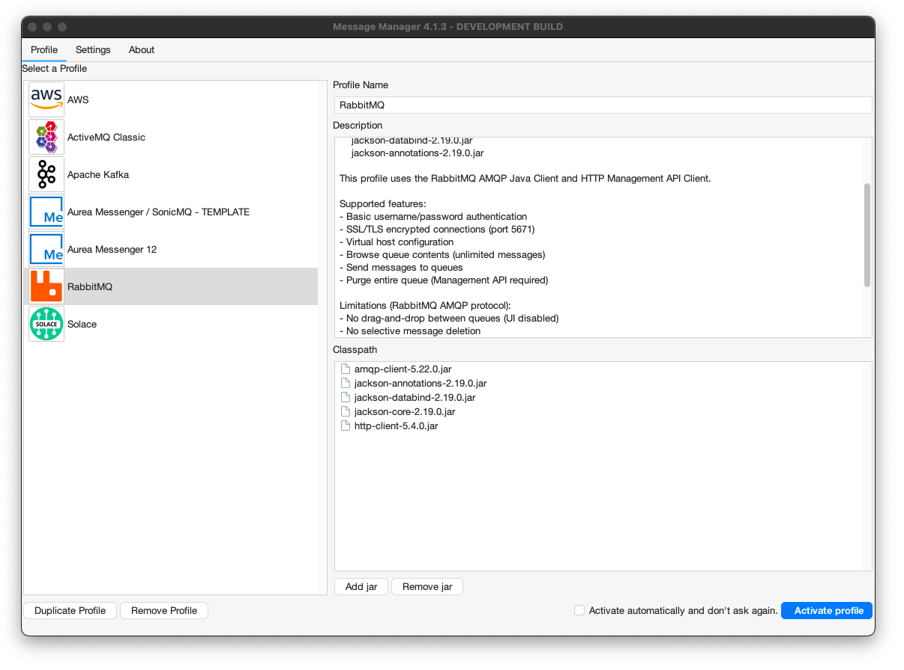
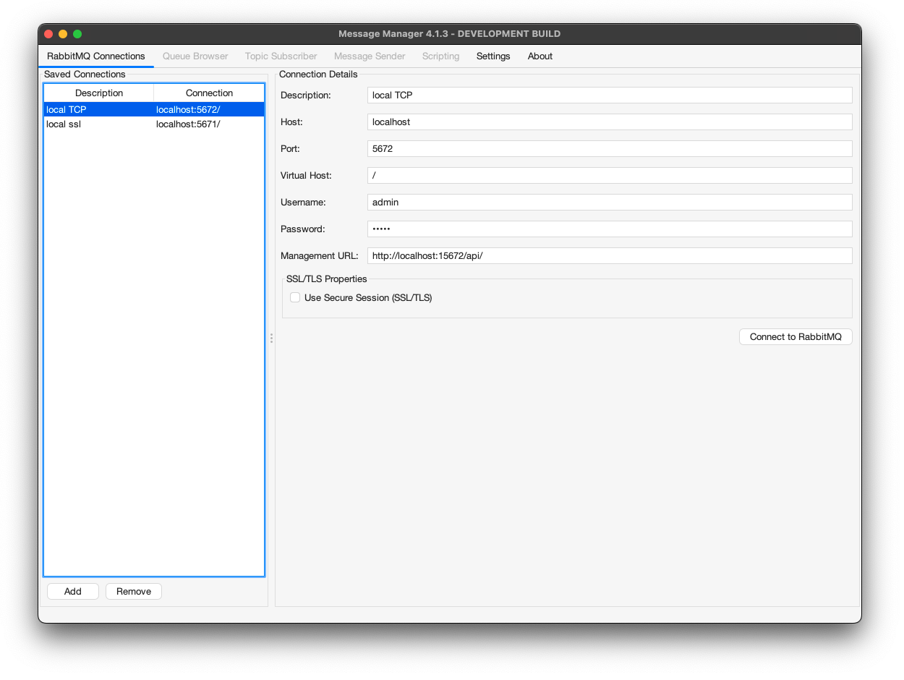

# RabbitMQ

To work with Message Manager and RabbitMQ, a connection to a RabbitMQ installation using a RabbitMQ Profile is required.

## RabbitMQ Profile

The RabbitMQ Profile is available from the Profile List.



In order for the RabbitMQ Profile to be activated, the required RabbitMQ client jars need to be added to the Message Manager classpath.
If the required RabbitMQ jars are not available in the classpath, they can be added using the 'Add JAR' button on the bottom middle of the window.
This will open a file selection dialog box where the proper RabbitMQ jar files can be added.

The required RabbitMQ jars are (version 5.22.0):
- amqp-client-5.22.0.jar
- http-client-5.4.0.jar
- jackson-core-2.19.0.jar
- jackson-databind-2.19.0.jar
- jackson-annotations-2.19.0.jar

:::note
The RabbitMQ client jars can be found in the Message Manager Clients RabbitMQ directory or downloaded from Maven Central.
By default they are already added to the classpath.
:::

When the proper RabbitMQ Client jars are added (or when they are already available in the profile), the RabbitMQ Profile can be activated by selecting the "Activate Profile" button on the bottom right of the window.

:::tip
The option "Activate automatically and don't ask again" can be selected to activate the selected RabbitMQ Profile automatically when Message Manager starts.
:::

## RabbitMQ Connections

After the RabbitMQ Profile is activated, a RabbitMQ Connection can be created or an existing RabbitMQ Connection can be selected.

Select the required Connection if it is available and press "Connect" to make the RabbitMQ Connection active.
If the required RabbitMQ Connection is not available, a new RabbitMQ Connection can be created.

## Create RabbitMQ Connection

To create a new RabbitMQ Connection, select the "New" button on the bottom (the green + button) and enter the new RabbitMQ Connection Information.

### TCP Connection (Non-SSL)

For a standard TCP connection to RabbitMQ:



- **Description**
    - A descriptive name for this Connection
- **Connection Details**
    - Host - The hostname or IP address of the RabbitMQ server
    - Port - The AMQP port (default: 5672 for non-SSL)
    - Virtual Host - The RabbitMQ virtual host (default: /)
    - Username - The RabbitMQ username for authentication
    - Password - The RabbitMQ password for authentication
- **Management API**
    - Management API URL - URL for RabbitMQ Management API (optional, for queue enumeration and bulk operations)
    - Example: `http://localhost:15672/api`

### SSL/TLS Connection

For a secure SSL/TLS connection to RabbitMQ:


- **Description**
    - A descriptive name for this Connection
- **Connection Details**
    - Host - The hostname or IP address of the RabbitMQ server
    - Port - The AMQPS port (default: 5671 for SSL/TLS)
    - Virtual Host - The RabbitMQ virtual host (default: /)
    - Username - The RabbitMQ username for authentication
    - Password - The RabbitMQ password for authentication
- **SSL/TLS**
    - Use SSL/TLS - Check this box to enable encrypted connections
    - Trust Store - Path to the Java truststore containing the RabbitMQ server's CA certificate
    - Trust Store Password - Password for the truststore file
- **Management API**
    - Management API URL - URL for RabbitMQ Management API (optional, should use HTTPS)
    - Example: `https://localhost:15671/api`

:::important
**SSL/TLS Truststore Configuration**

When connecting via SSL/TLS, you must configure a truststore containing the Certificate Authority (CA) certificate that signed your RabbitMQ server's certificate:

1. Obtain the CA certificate from your RabbitMQ server administrator
2. Import the CA certificate into a Java truststore using `keytool`:
   ```bash
   keytool -import -alias rabbitmq-ca -file ca-cert.pem -keystore truststore.jks -storepass changeit
   ```
3. Specify the truststore path and password in the SSL/TLS section

If you're using self-signed certificates, import the self-signed certificate itself into the truststore.
:::

### Connecting

When all the required information is entered, press the "Connect" button to activate the RabbitMQ Connection and switch to the Queue Browser tab of Message Manager.

Select the Queue you wish to browse and the message in the Queue (if any) to show the Message Details.

## Supported Features

The RabbitMQ profile supports:
- **Queue Operations**
  - Browse queue contents (consumer-based browsing with configurable limits)
  - Send messages to queues
  - Purge entire queue (Management API required)
  - Queue enumeration via Management API
- **Topic Subscriber**
  - Subscribe to topic exchanges using routing patterns
  - Format: `exchange:pattern` (e.g., `amq.topic:#`)
  - Topics without colon default to `amq.topic` exchange
  - Wildcard patterns: `#` (zero or more words), `*` (exactly one word)
  - Multiple subscribers receive message copies (pub/sub semantics)
  - Automatic exchange discovery via Management API
  - Publish messages to topic exchanges
- **Security**
  - Basic username/password authentication
  - SSL/TLS encrypted connections (port 5671)
  - Virtual host configuration

## Limitations

Due to the RabbitMQ AMQP protocol implementation:
- No drag-and-drop between queues (UI disabled)
- No selective message deletion
- Scripts: Only COPY action available (MOVE hidden)
