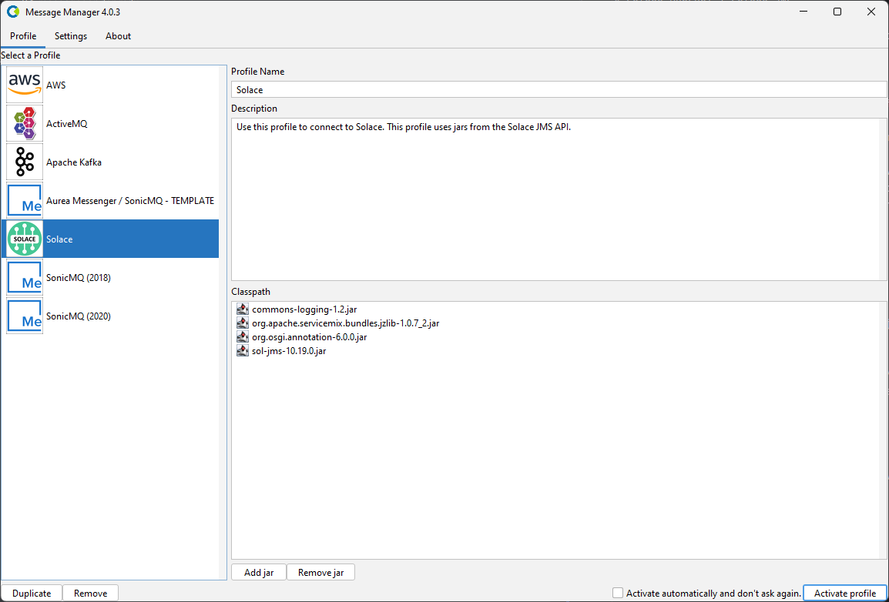
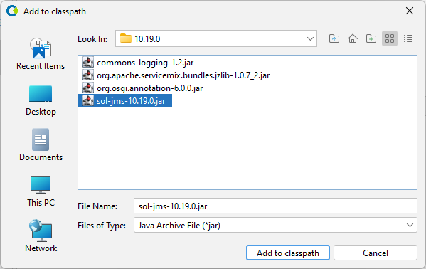
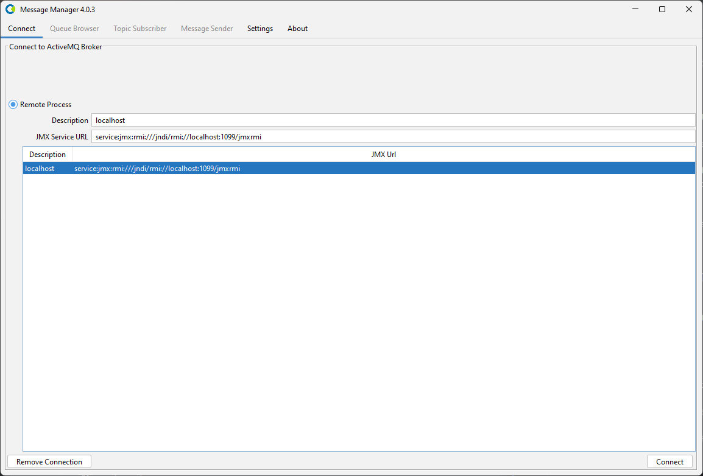
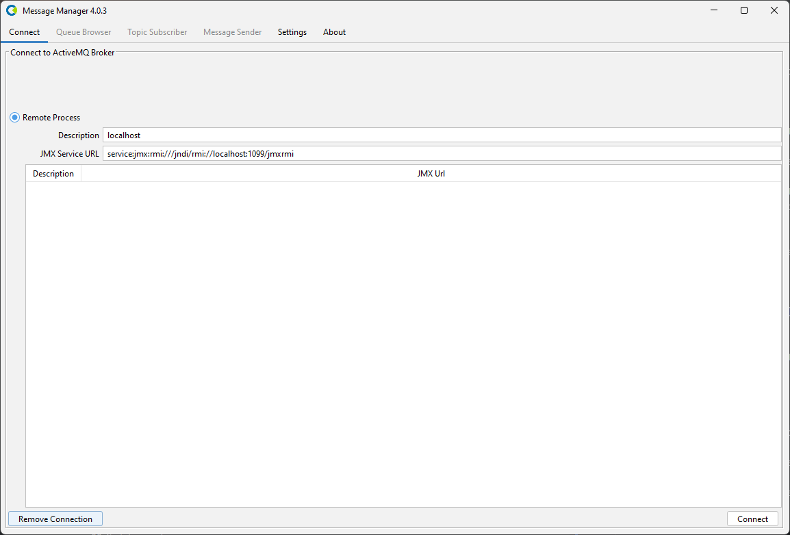
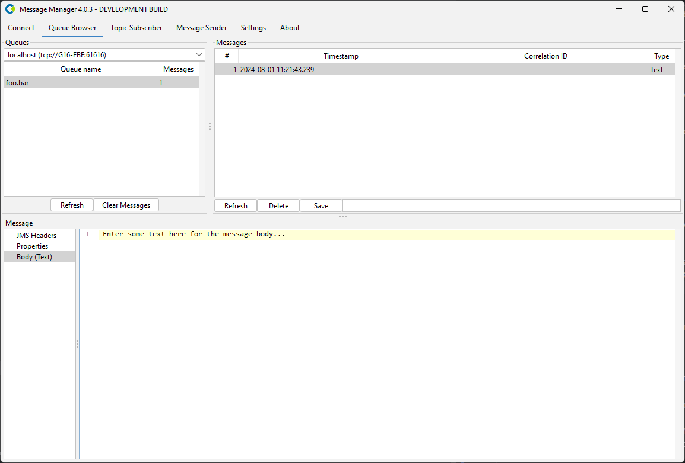

# Solace PubSub+ / Solace JMS

To work with Message Manager and Solace, a connection to a Solace installation using a Solace Profile is required.

## Solace Profile

The Solace Profile is available from the Profile List.

In order for the ActiveMQ Profile to be activated, the required ActiveMQ jars need to be added to the Message Manager classpath.
If the required ActiveMQ jars are not available in the classpath, they can be added using the 'Add JAR' button on the bottom middle of the window.
This will open a file selection dialog box where the proper ActiveMQ jar files can be added.
The required ActiveMQ jars are:
- activemq-client-x.xx.x.jar
- hawtbuf-1.11.jar
- geronimo-j2ee-management-1.0-spec-1.1.jar
- geronimo-jta-1.1-spec-1.1.1.jar

:::note
The Solace Client jars can be found in the Solace installation under the Message Manager Clients directory or downloaded separately.
:::

When the proper Solace Client jars are added (or when they are already available in the profile), the Solace Profile can be activated by selecting the "Activate Profile" button on the bottom right of the window.

:::tip
The option "Activate automatically and don't ask again" can be selected to activate the selected ActiveMQ Profile automatically when Message Manager starts.
:::

## Solace Connections

After the Solace Profile is activated, a Solace Connection can be created or an existing Solace Connection can be selected.

:::note
Message Manager uses JMX to connect to an ActiveMQ environment. It will then query the ActiveMQ environment for the available Brokers and Queues.
The ActiveMQ Connections require the JMX format: `service:jmx:rmi:///jndi/rmi://<host>:<port>/jmxrmi`
:::

Select the required Connection if it is available and press "Connect" to make the ActiveMQ Connection active.
If the required ActiveMQ Connection is not available, a new ActiveMQ Connection can be created.

## Create ActiveMQ Connection

To create a new ActiveMQ Connection, select the "Remote Process" Radio Button and fill out the new ActiveMQ Connection Information. 
- Description
    - A descriptive name for this Connection.
- JMX Service URL
    - The JMX Service URL of the ActiveMQ Installation to connect to.
    - The JMX Service URL format: `service:jmx:rmi:///jndi/rmi://<host>:<port>/jmxrmi`

When all the required information is entered, press the "Connect" button to activate the ActiveMQ Connection and switch to the Queue Browser tab of Message Manager.

Select the Queue you wish to browse and the message in the Queue (if any) to show the Message Details.
