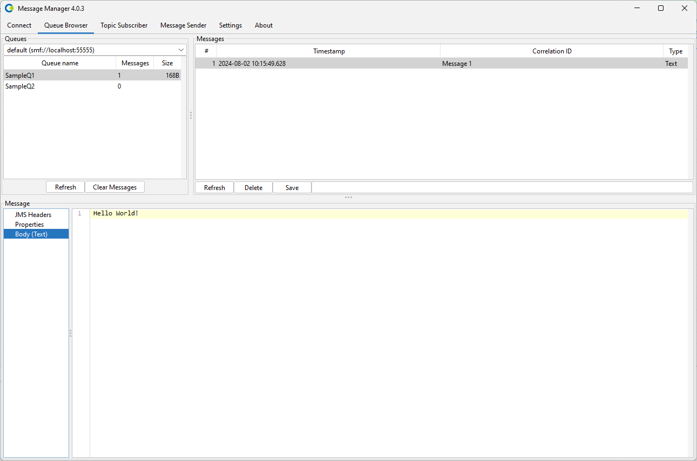

# Solace PubSub+ / Solace JMS

To work with Message Manager and Solace, a connection to a Solace installation using a Solace Profile is required.

## Solace Profile

The Solace Profile is available from the Profile List.

In order for the Solace Profile to be activated, the required Solace Client jars need to be added to the Message Manager classpath.
If the required Solace Client jars are not available in the classpath, they can be added using the 'Add JAR' button on the bottom middle of the window.
This will open a file selection dialog box where the proper Solace Client jar files can be added.
The required Solace Client jars are:
- commons-logging-1.2.jar
- org.apache.servicemix.bundles.jzlib-1.0.7_2.jar
- org.osgi.annotation-6.0.0.jar
- sol-jms-10.19.0.jar

:::note
The Solace Client jars can be found in the Solace installation under the Message Manager Clients directory or downloaded separately.
:::

When the proper Solace Client jars are added (or when they are already available in the profile), the Solace Profile can be activated by selecting the "Activate Profile" button on the bottom right of the window.

:::tip
The option "Activate automatically and don't ask again" can be selected to activate the selected ActiveMQ Profile automatically when Message Manager starts.
:::

## Solace Connections

After the Solace Profile is activated, a Solace Connection can be created or an existing Solace Connection can be selected.

Select the required Connection if it is available and press "Connect to Appliance" to make the Solace Connection active.
If the required Solace Connection is not available, a new Solace Connection can be created.

## Create Solace Connection

To create a new Solace Connection, select the "New" button on the bottom (the green + button) and enter the new Solace Connection Information.
    - Description - A descriptive name for this Connection.
    - URI - This string is created using the information entered in the connection details screen.

    - Connection Details
        - Connection Type
            - SEMP over HTTP(s)
            - SEMP over Message Bus
        - Appliance Properties
            - Appliance Hostname
            - Appliance Port
        - Authentication
            - Username
            - Password
        - TLS Properties
            - Use Secure Session
        - Messaging Properties
            - Messaging Host
            - Messaging Port

When all the required information is entered, press the "Connect to Appliance" button to activate the Solace Connection and switch to the Queue Browser tab of Message Manager.

Select the Queue you wish to browse and the message in the Queue (if any) to show the Message Details.
