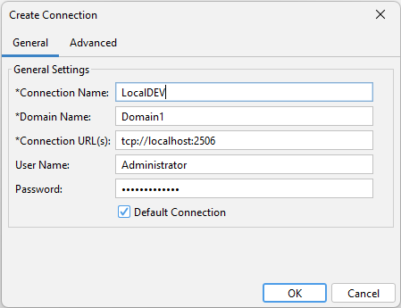

# Aurea Messenger / SonicMQ

To work with Message Manager and Aurea Messenger / SonicMQ you first need to make a connection to a Sonic
Domain. After you connected to the Domain, automatically all active brokers are discovered including all
queue's for each broker.

## Create Connection

When you start Message Manager and select the Aurea Messenger / SonicMQ Profile, you get a connection dialog
to setup a connection to the Sonic domain. Make sure you fill in all entries.
The Connections available will be shared with the SMC (Sonic Management Console) and are stored

The following fields are required (*):
- Connection name
    - A descriptive name for this Connection.
- Domain Name
    - The name of the Sonic Domain to connect to.
- Connection URL(s)
    - The URL(s) of the Management Broker(s) to connect to. You can enter multiple URLs separated by a comma.
- User Name
    - The user name to use when connecting to the Management Broker(s) if security is enabled.
- Password
    - The password to use when connecting to the Management Broker(s) if security is enabled.

The optional field 'Default Connection' is used to store the current Connection as the default. This is useful if
you use this Connection often and want to get it automatically selected when you start Message Manager.

After you successfully connected to a Sonic Domain you automatically switch to the next tab, "Queue Browser".

## Required permissions for using Message Manager

Since Message Manager uses management requests to determine the available brokers and queues, you need to have certain
permissons on the Sonic Domain you are trying to connect to. Any member of the Administrators Group already has these
permissions but any other user (by default) does not.

The required ACLs (for the Management Broker) are:

This will allow any user in the group SMMUsers to connect to the Domain. If you do not use management security
(available from Sonic MQ 7.0), this will also allow these users to perform most management operations using the
Sonic Management Console.

If you are using management security, be sure to allow the following operations:

