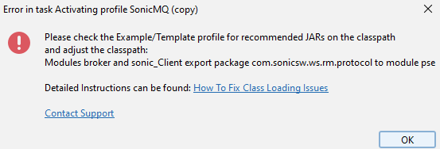

import ReactPlayer from 'react-player'


# How To Fix Class Loading Issues

Message Manager uses Java Modules for classloading. This may cause issues with some providers that do not fully support this yet.

## Example

SonicMQ does not support Java Modules. This means that if you are using SonicMQ as your broker, you will have to ensure that you have only specific jars on your classpath.
If you have additional jars in your classpath, you will most likely get an error like this:



## Solution

You need to ensure the classpath of the profile only contains the required jars.
After the installation of Message Manager, Example/Template profiles are created.
These profiles usually list the required jars in the classpath.

i.e. for SonicMQ you select the "Aurea Messenger / SonicMQ - TEMPLATE" profile and take a look at the classpath field.

Take a note of the jars that are listed in the classpath field. Then remove all configured JARs on your profile and then click the "Add jar" button and add the required jars.

:::tip

Navigate to the folder where the JARs are located. Then copy paste the JAR list (below is an example for Sonic, or copy from the template profile) to the File selection Dialog and press OK

:::

```
xercesImpl.jar
sonic_XMessage.jar
sonic_Client_ext.jar
smc.jar
sonic_Crypto.jar
mail.jar
sonic_Client.jar
mgmt_client.jar
mgmt_config.jar
sonic_Selector.jar
sonic_mgmt_client.jar
sonic_SSL.jar
```

Once you have added the required jars, you have to double check that the classpath field contains only the required jars.
Sometimes additional jars are added because they are referenced in the JAR manifest file.

## Solution Video
<ReactPlayer controls url='/videos/howtoFixClassloading.mp4' />


